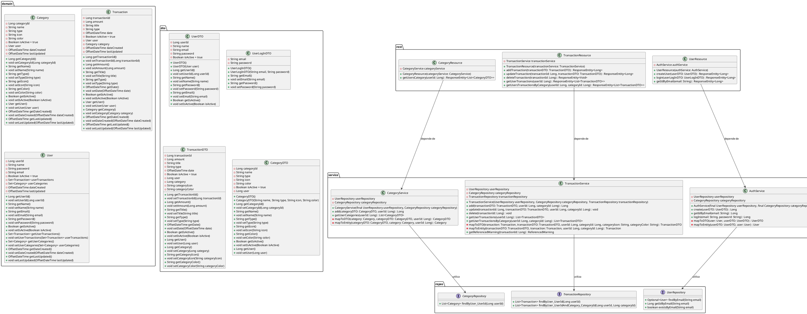

```plantuml

@startuml

package domain {

    class Category {
        - Long categoryId
        - String name
        - String type
        - String icon
        - String color
        - Boolean isActive = true
        - User user
        - OffsetDateTime dateCreated
        - OffsetDateTime lastUpdated

        + Long getCategoryId()
        + void setCategoryId(Long categoryId)
        + String getName()
        + void setName(String name)
        + String getType()
        + void setType(String type)
        + String getIcon()
        + void setIcon(String icon)
        + String getColor()
        + void setColor(String color)
        + Boolean getIsActive()
        + void setIsActive(Boolean isActive)
        + User getUser()
        + void setUser(User user)
        + OffsetDateTime getDateCreated()
        + void setDateCreated(OffsetDateTime dateCreated)
        + OffsetDateTime getLastUpdated()
        + void setLastUpdated(OffsetDateTime lastUpdated)
    }

    class Transaction {
        - Long transactionId
        - Long amount
        - String title
        - String type
        - OffsetDateTime date
        - Boolean isActive = true
        - User user
        - Category category
        - OffsetDateTime dateCreated
        - OffsetDateTime lastUpdated

        + Long getTransactionId()
        + void setTransactionId(Long transactionId)
        + Long getAmount()
        + void setAmount(Long amount)
        + String getTitle()
        + void setTitle(String title)
        + String getType()
        + void setType(String type)
        + OffsetDateTime getDate()
        + void setDate(OffsetDateTime date)
        + Boolean getIsActive()
        + void setIsActive(Boolean isActive)
        + User getUser()
        + void setUser(User user)
        + Category getCategory()
        + void setCategory(Category category)
        + OffsetDateTime getDateCreated()
        + void setDateCreated(OffsetDateTime dateCreated)
        + OffsetDateTime getLastUpdated()
        + void setLastUpdated(OffsetDateTime lastUpdated)
    }

    class User {
        - Long userId
        - String name
        - String password
        - String email
        - Boolean isActive = true
        - Set<Transaction> userTransactions
        - Set<Category> userCategories
        - OffsetDateTime dateCreated
        - OffsetDateTime lastUpdated

        + Long getUserId()
        + void setUserId(Long userId)
        + String getName()
        + void setName(String name)
        + String getEmail()
        + void setEmail(String email)
        + String getPassword()
        + void setPassword(String password)
        + Boolean getIsActive()
        + void setIsActive(Boolean isActive)
        + Set<Transaction> getUserTransactions()
        + void setUserTransactions(Set<Transaction> userTransactions)
        + Set<Category> getUserCategories()
        + void setUserCategories(Set<Category> userCategories)
        + OffsetDateTime getDateCreated()
        + void setDateCreated(OffsetDateTime dateCreated)
        + OffsetDateTime getLastUpdated()
        + void setLastUpdated(OffsetDateTime lastUpdated)
    }

}

package dto {
class UserDTO {
        - Long userId
        - String name
        - String email
        - String password
        - Boolean isActive = true

        + UserDTO()
        + UserDTO(User user)
        + Long getUserId()
        + void setUserId(Long userId)
        + String getName()
        + void setName(String name)
        + String getPassword()
        + void setPassword(String password)
        + String getEmail()
        + void setEmail(String email)
        + Boolean getIsActive()
        + void setIsActive(Boolean isActive)
}

class UserLogInDTO {
        - String email
        - String password

        + UserLogInDTO()
        + UserLogInDTO(String email, String password)
        + String getEmail()
        + void setEmail(String email)
        + String getPassword()
        + void setPassword(String password)
    }

class TransactionDTO {
- Long transactionId
        - Long amount
        - String title
        - String type
        - OffsetDateTime date
        - Boolean isActive = true
        - Long user
        - Long category
        - String categoryIcon
        - String categoryColor

        + Long getTransactionId()
        + void setTransactionId(Long transactionId)
        + Long getAmount()
        + void setAmount(Long amount)
        + String getTitle()
        + void setTitle(String title)
        + String getType()
        + void setType(String type)
        + OffsetDateTime getDate()
        + void setDate(OffsetDateTime date)
        + Boolean getIsActive()
        + void setIsActive(Boolean isActive)
        + Long getUser()
        + void setUser(Long user)
        + Long getCategory()
        + void setCategory(Long category)
        + String getCategoryIcon()
        + void setCategoryIcon(String categoryIcon)
        + String getCategoryColor()
        + void setCategoryColor(String categoryColor)
}

 class CategoryDTO {
        - Long categoryId
        - String name
        - String type
        - String icon
        - String color
        - Boolean isActive = true
        - Long user

        + CategoryDTO()
        + CategoryDTO(String name, String type, String icon, String color)
        + Long getCategoryId()
        + void setCategoryId(Long categoryId)
        + String getName()
        + void setName(String name)
        + String getType()
        + void setType(String type)
        + String getIcon()
        + void setIcon(String icon)
        + String getColor()
        + void setColor(String color)
        + Boolean getIsActive()
        + void setIsActive(Boolean isActive)
        + Long getUser()
        + void setUser(Long user)
    }
}

package repos {
  interface CategoryRepository {
        + List<Category> findByUser_UserId(Long userId)
    }

    interface TransactionRepository {
        + List<Transaction> findByUser_UserId(Long userId)
        + List<Transaction> findByUser_UserIdAndCategory_CategoryId(Long userId, Long categoryId)
    }

interface UserRepository {
        + Optional<User> findByEmail(String email)
        + Long getIdByEmail(String email)
        + boolean existsByEmail(String email)
    }
}


package service {
class AuthService {
        - UserRepository userRepository
        - CategoryRepository categoryRepository
        +  AuthService(final UserRepository userRepository, final CategoryRepository categoryRepository)
        + create(userDTO: UserDTO) : Long
        + getIdByEmail(email: String) : Long
        + logIn(email: String, password: String) : Long
        - mapToDTO(user: User, userDTO: UserDTO) : UserDTO
        - mapToEntity(userDTO: UserDTO, user: User) : User
    }

class CategoryService {
        - UserRepository userRepository
        - CategoryRepository categoryRepository
        + CategoryService(final UserRepository userRepository, CategoryRepository categoryRepository)
        + add(categoryDTO: CategoryDTO, userId: Long) : Long
        + getUserCategories(userId: Long) : List<CategoryDTO>
        - mapToDTO(category: Category, categoryDTO: CategoryDTO, userId: Long) : CategoryDTO
        - mapToEntity(categoryDTO: CategoryDTO, category: Category, userId: Long) : Category
    }

class TransactionService {
        - UserRepository userRepository
        - CategoryRepository categoryRepository
        - TransactionRepository transactionRepository
        + TransactionService(UserRepository userRepository, CategoryRepository categoryRepository, TransactionRepository transactionRepository)
        + add(transactionDTO: TransactionDTO, userId: Long, categoryId: Long) : Long
        + update(transactionId: Long, transactionDTO: TransactionDTO, userId: Long, categoryId: Long) : void
        + delete(transactionId: Long) : void
        + getUserTransactions(userId: Long) : List<TransactionDTO>
        + getUserTransactionsByCategory(userId: Long, categoryId: Long) : List<TransactionDTO>
        - mapToDTO(transaction: Transaction, transactionDTO: TransactionDTO, userId: Long, categoryId: Long, categoryIcon: String, categoryColor: String) : TransactionDTO
        - mapToEntity(transactionDTO: TransactionDTO, transaction: Transaction, userId: Long, categoryId: Long) : Transaction
        + getReferencedWarning(transactionId: Long) : ReferencedWarning
    }


   }

package rest {
 class CategoryResource {
        - CategoryService categoryService
        + CategoryResource(categoryService: CategoryService)
        + getUsersCategory(userId: Long) : ResponseEntity<List<CategoryDTO>>
    }

    class TransactionResource {
        - TransactionService transactionService
        + TransactionResource(transactionService: TransactionService)
        + addTransaction(transactionDTO: TransactionDTO) : ResponseEntity<Long>
        + updateTransaction(transactionId: Long, transactionDTO: TransactionDTO) : ResponseEntity<Long>
        + deleteTransaction(transactionId: Long) : ResponseEntity<Void>
        + getUserTransactions(userId: Long) : ResponseEntity<List<TransactionDTO>>
        + getUsersTransactionsByCategory(userId: Long, categoryId: Long) : ResponseEntity<List<TransactionDTO>>
    }

 class UserResource {
        - AuthService authService
        + UserResource(authService: AuthService)
        + createUser(userDTO: UserDTO) : ResponseEntity<Long>
        + login(userLogInDTO: UserLogInDTO) : ResponseEntity<Long>
        + getIdByEmail(email: String) : ResponseEntity<Long>
    }

}

AuthService --> UserRepository : "utiliza"
CategoryService --> CategoryRepository : "utiliza"
TransactionService --> TransactionRepository : "utiliza"
UserResource --> AuthService : "depende de"
CategoryResource --> CategoryService : "depende de"
 TransactionResource --> TransactionService : "depende de"
@enduml


```
